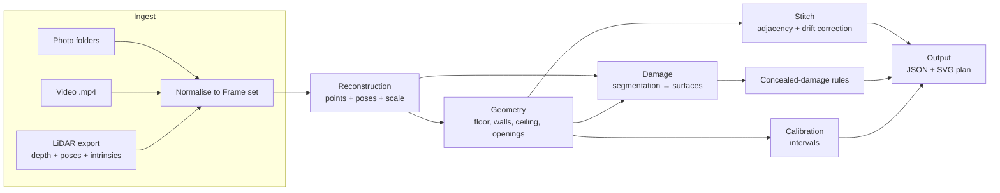

# System Design — Room Scanning & Damage Assessment Pipeline

**Author:** Gautam Mahli
**Scope:** Architecture for all three input tiers (Photo, Video, LiDAR). All three tiers are built and evaluated on the sample captures provided by the hiring team.

---

## 1. Context and constraints

The case study asks for a pipeline that takes handheld phone captures at three tiers (photos, video, LiDAR) and produces one output contract: dimensioned per-room plans, a stitched multi-room plan, damage regions, concealed-damage flags, scope line items, and a confidence interval on every measurement.

**Input data.** As agreed with the hiring team by email, the pipeline is built and evaluated on the **three sample captures they provided** (`single_room`, `single_scan_floor_only`, `single_scan_with_ceiling`). No other captures are used.

**How one sample capture feeds all three tiers.** Each sample is a Stray Scanner export containing an ordinary RGB video alongside the LiDAR data, so the same room is run at every tier:

| Tier | Input derived from the sample | What is deliberately withheld |
|---|---|---|
| LiDAR | `depth/`, `confidence/`, `odometry.csv`, `camera_matrix.csv`, `rgb.mp4` | Nothing |
| Video | `rgb.mp4` only | Depth, poses, intrinsics, IMU |
| Photo | 2–8 frames extracted from `rgb.mp4`, saved as plain images | Depth, poses, intrinsics, frame order |

This satisfies "the same rooms captured at all three input tiers" and has a second benefit: because the Video and Photo tiers run on exactly the same room, the **LiDAR result serves as a reference** for measuring how much accuracy each thinner tier loses.

**What the samples actually contain (verified by fusing each capture).** Despite the folder names, only one sample is a single room:

| Sample | Frames | Path walked | Footprint | Content |
|---|---|---|---|---|
| `single_room` | 1715 | 14.5 m | ~6 × 6 m | One room |
| `single_scan_floor_only` | 5251 | 54 m | ~10 × 10 m | Whole property: ~5 rooms + corridor; ceiling not scanned |
| `single_scan_with_ceiling` | 9745 | 100 m | ~10.5 × 11 m | **Same property** again, with ceiling; path revisits rooms (loops) |

The two `single_scan_*` captures share the same layout (central corridor, same bedrooms), and `single_room` appears to be one room of that property. Consequences for the design:
- **Multi-room stitching, adjacency and the drift ablation run on real data** (both whole-property scans).
- **Repeatability is measurable at the LiDAR tier:** the property is captured twice, and one room three times.
- **Loop closure has real revisits** to work with in `single_scan_with_ceiling`.
- **Ceiling height** is measurable only in `single_scan_with_ceiling` (peak ~2.34 m above floor before refinement); the other two report it as unobserved, so the ceiling-repeatability spread cannot be measured.

**Robustness to real phone input.** The walk-in test uses the evaluators' own iPhone, so the Photo and Video loaders are written to accept native iPhone files, not just frames cut from the sample video: HEIC/JPEG photos, MOV/MP4 video, EXIF orientation, and arbitrary resolution.

**Design principles:**
1. **One output contract for every tier.** Tiers differ only in how much they know, which shows up as wider intervals, never as a different schema.
2. **Honest uncertainty over confident numbers.** If something wasn't observed (e.g. a ceiling that was never scanned), the output says so instead of guessing.
3. **Everything regenerable.** One command per capture; every reported number can be reproduced from raw inputs.
4. **Runs fully offline.** No calls to my infrastructure; model weights are fetched by script.

---

## 2. Technology stack

| Layer | Choice | Why |
|---|---|---|
| Pipeline, geometry, measurement, output | **Go** | Fast, single static binary, simple deployment, strong concurrency for per-frame processing. The LiDAR tier is pure Go. |
| Linear algebra / stats | `gonum` | Matrices, SVD/eigen decomposition, quaternions, statistics |
| Depth / image decoding | Go stdlib `image/png` | Reads 16-bit depth PNGs natively (`image.Gray16`) |
| Video frame extraction | `ffmpeg` via `os/exec` | Reliable HEVC decoding |
| Output validation | JSON Schema (`santhosh-tekuri/jsonschema`) | Output is validated against the published schema on every run |
| Plan rendering | SVG (generated in Go) | Vector, dimensioned, viewable in any browser |
| ML inference (Photo/Video tiers, damage) | **Python 3.12** subprocess (`ml/.venv`, created by `uv`) | The models (VGGT, Depth Pro, OWLv2) only exist in the PyTorch ecosystem |
| Reproducibility | `scripts/setup.sh`, `scripts/fetch_weights.py`, `scripts/run_samples.sh`, `scripts/fixloop.sh` | Clean-machine LiDAR setup in about a minute; every reported number regenerated by script |

**Go ↔ Python boundary.** Go owns orchestration and all geometry. Python is called only for model inference. The video and photo tiers write their result as a **Stray Scanner–style export** (depth PNGs, per-frame poses and intrinsics, `meta.json` with tier and scale uncertainty), so all tiers share one geometry pipeline. Damage detection writes `detections.json` (boxes per frame). Outputs are cached keyed on the input files' paths, sizes and modification times, and replay deterministically; `-live` always runs the models.

---

## 3. Architecture



**Common internal representation.** Every tier is normalised to the same structure before any geometry runs:

```go
type Frame struct {
    Index      int
    Timestamp  float64
    RGBPath    string
    Depth      *DepthMap      // nil for photo/video until estimated
    Confidence *ConfMap       // nil if the sensor doesn't provide it
    Pose       *Pose          // camera-to-world; nil for unposed photos
    K          Intrinsics
    Source     Tier           // Photo | Video | LiDAR
}
```

Downstream stages never branch on tier; they read which fields are present and how uncertain they are.

### Repository layout

```
cmd/scan/            # scan run <capture> [-tier lidar|video|photo] → one command per capture
cmd/bench/           # bench repeat | overlay | calibrate → repeatability tables, calibration
internal/ingest/     # strayscanner/ (also reads the video/photo exports) → []Frame
internal/geometry/   # pointcloud, floor, Manhattan, walls, gaps, rooms, outlines, ceilings, openings
internal/stitch/     # plane-anchored drift correction
internal/calib/      # measurement-model and empirical (conformal) intervals
internal/damage/     # detections → surfaces, multi-view merge, concealed-damage rules
internal/bench/      # cross-capture registration, matching, calibration pairs
internal/pipeline/   # orchestration, assembly into the output contract
internal/output/     # JSON (schema-validated) + SVG renderer
ml/                  # Python: video_recon, photo_recon (VGGT, Depth Pro), damage_detect (OWLv2)
schema/plan.schema.json
scripts/             # setup, fetch_weights, run_samples, fixloop, make_photo_sets, diagnostics
fixloop/             # Part 4 bundle
docs/                # compliance matrix, capture protocol, device matrix, benchmark, technical report
results/             # per-capture outputs (regenerated, not committed)
```

---

## 4. LiDAR tier

### 4.1 Sample data format (verified)

The sample captures are **Stray Scanner** exports from a Pro-class iPhone. Inspection of `single_room`:

| File | Contents | Verified details |
|---|---|---|
| `rgb.mp4` | Camera video | HEVC, 1920×1440, 1715 frames, 37.2 s |
| `depth/NNNNNN.png` | LiDAR depth, one per frame | 256×192, uint16, **millimetres** |
| `confidence/NNNNNN.png` | Per-pixel confidence | Values 0/1/2; ~93% of pixels at level 2 |
| `odometry.csv` | ARKit pose per frame | `timestamp, frame, x, y, z, qx, qy, qz, qw, fx, fy, cx, cy` |
| `camera_matrix.csv` | Intrinsics at RGB resolution | fx = fy ≈ 1599.7, cx ≈ 955.5, cy ≈ 717.8 |
| `imu.csv` | Accelerometer + gyro | Higher rate than video |

Depth, confidence, video frames and poses are aligned 1:1 by frame index (1715 each, contiguous).

### 4.2 Pipeline

**Step 1 — Ingest.** Parse the CSVs, decode the depth/confidence PNGs, and scale intrinsics from RGB resolution to depth resolution (factor 256/1920). Per-frame intrinsics from `odometry.csv` take precedence over `camera_matrix.csv`.

**Step 2 — Back-projection.** For each pixel with confidence 2 and valid depth:

```
z = depth_mm / 1000
x = (u − cx) · z / fx
y = (v − cy) · z / fy
p_world = R(q) · [x, y, z]ᵀ + t
```

> **Convention finding:** the depth back-projects correctly using the **OpenCV camera convention** (x right, y down, z forward) with the odometry pose. Using the ARKit convention (y up, z backward) produces a vertically inverted room. Verified by fusing both ways: only the OpenCV version gives a single sharp floor plane. This is covered by a unit test.

**Step 3 — Fusion and downsampling.** Frames are fused into a voxel grid (2 cm). Each voxel keeps its point count and the number of distinct frames that observed it. Single-frame voxels are dropped as noise and reflection artefacts.

**Step 4 — Gravity and floor.** ARKit's world Y axis is gravity-aligned. The floor is the dominant horizontal plane at the lowest height (histogram peak, refined by RANSAC). In `single_room` the floor sits 1.474 m below the starting phone position, with a sharp peak, which indicates good pose quality.

**Step 5 — Manhattan alignment.** Most rooms have walls at right angles. Dominant wall directions are estimated from vertical-plane normals, and the scene is rotated so walls align to the X/Z axes. In `single_room` the walls are rotated roughly 30° relative to ARKit's world frame (visual estimate from the plan). Non-Manhattan walls are kept with their true angle, not forced to 90°.

**Step 6 — Wall extraction.** Sequential RANSAC on vertical planes in the 0.3–2.0 m height band, where walls are least occluded by furniture. Planes are projected to 2D line segments and merged when collinear. Wall length comes from the extent of the inlier points along the line.

**Step 7 — Openings.** A wall with a vertical gap reaching floor level is a door candidate; a gap with wall above and below is a window candidate. Width is measured between the jamb edges. Any gap is classified as one of:
- **Opening**: free space observed *through* the gap (depth readings beyond the wall plane)
- **Unobserved**: no measurements behind or within the gap, so it isn't reported as an opening (avoids phantom openings)
- **Glass**: sparse or inconsistent returns in the gap; flagged rather than reported as an opening

**Step 8 — Ceiling.** The ceiling is the dominant horizontal plane above the walls. If too few points above ~2.2 m have been observed, the ceiling is reported as **`"observed": false`** with no height value, or a wide prior-based interval clearly labelled as a prior. In `single_room` the observed points stop at about 2.1 m above the floor, so the ceiling was not captured and must be reported as unobserved. `single_scan_with_ceiling` is the case where it is measured.

**Step 9 — Floor area and room polygon.** The room polygon is the closed loop of wall segments. Missing walls are closed using floor-coverage boundaries and are marked as inferred. Floor area is the polygon area.

### 4.3 Drift handling

ARKit performs visual-inertial odometry with its own internal corrections, but accumulated drift is still possible on long multi-room walks. The design:

1. **Detect drift.** The walk is split into 4 s chunks. Every chunk observes each measured wall face (binned in 0.5 m segments) and the floor through its own depth points; only frames whose camera is inside a room observe that room's walls, so the far face of a thick wall is never associated. The scatter of those per-chunk observations about each wall is the drift measure.
2. **Plane-anchored correction.** Each chunk gets a rigid correction (plan translation, yaw, vertical shift), linearly interpolated in time. One linear least-squares problem solves chunk corrections and landmark (wall, floor) positions together, with a random-walk prior between neighbouring chunks; the first chunk is the gauge. Two iterations, re-fusing and re-fitting in between.
3. **Loop closure.** A room re-entered late in the walk re-observes the same wall faces, which ties late chunks to early ones. This replaces the point-cloud ICP originally planned; landmark re-observation gives the same constraint for walls and does not depend on overlap in raw points.
4. **Guarding against overfitting.** Chunk corrections have many degrees of freedom, so the prior strength is chosen on held-out data: odd wall segments are never fitted, and the correction is applied only if it lowers held-out scatter by at least 5% over no correction. Otherwise poses are kept and the report says drift was not detectable.
5. **Ablation.** Every LiDAR run writes the plan with correction **on** (`plan.json`) and **off** (`plan_drift_off.json`), plus `drift.json` with per-chunk corrections, held-out scores and both footprints.

**Observation on the samples:** drift is real and small. Wall-observation scatter, uncorrected → corrected: `single_room` 16.4 → 9.6 mm, `single_scan_floor_only` 20.4 → 13.6 mm, `single_scan_with_ceiling` 20.9 → 12.8 mm; on held-out wall segments the correction lowers scatter in every case (e.g. 21.2 → 15.2 mm). Corrections reach 5–10 cm translation and under 1° yaw; most chunks share a ~0.7° heading offset relative to the first 4 s, consistent with ARKit's heading settling at the start of a session. Footprint effect is reported per capture in `drift.json`.

### 4.4 Known failure modes (seen in the sample data)

| Surface | Effect on LiDAR | Handling |
|---|---|---|
| Glass shower screen | Sparse or pass-through returns; can look like an opening | Gap classified as glass when returns are sparse/inconsistent |
| TV screen, stainless fridge | Specular reflection, phantom points behind the surface | Multi-frame consistency filter; points behind a fitted wall plane are rejected |
| Mirrors | Phantom "rooms" behind the mirror | Points behind a closed wall plane are discarded; large mirrored regions are flagged |
| Low light | LiDAR depth unaffected; RGB (and damage detection) degrades | Damage confidence lowered; noted in output |
| Long range | Depth noise grows with distance | Points beyond ~4 m down-weighted |

---

## 5. Video tier

**Input on the sample data:** `rgb.mp4` alone, with the depth maps and ARKit poses ignored. Note that the sample video is stored in the sensor's landscape orientation while the phone was held in portrait, so frames appear rotated; the loader handles orientation explicitly.

As built ([ml/video_recon.py](ml/video_recon.py)); the measurements behind each choice are in [docs/TECHNICAL_REPORT.md §4](docs/TECHNICAL_REPORT.md):

1. **Frames.** `ffmpeg` at 6 fps, keeping the sharper of each pair (3 fps).
2. **Orientation.** Sideways video is detected: straight-line directions pick the vertical axis and depth ordering picks the sign. Frames are rotated upright for the models.
3. **Poses and depth.** VGGT-1B on 8-frame chunks (fits 4 GB with the aggregator in fp16), chained by a similarity fitted on shared frames. Incremental SfM (COLMAP) was tried and registered only 49 of 223 frames, because people pan in place.
4. **Metric scale.** Apple Depth Pro, rescaled by (VGGT focal / Depth Pro focal). Depth Anything V2 Metric read 1.5–2.0× deep on these frames; focal-corrected Depth Pro reads 0.97–1.12× LiDAR. The scale uncertainty (from the spread across frames, with a 6% bias floor) is added to every interval.
5. **Geometry.** The export goes through the same Go pipeline, with fusion and the plan raster adapted to noisy model depth (4 cm voxels, one view, 5 cm raster). Rooms whose walls cannot be fitted are outlined from free space, with every wall inferred.

**Status:** runs end to end, not accurate. Chunk chaining accumulates to 70 cm and 18% scale over 14.6 m, so walls are not fitted. Global alignment of the chunks (loop closure plus a pose graph) is the identified next step.

**Target gate:** wall lengths within ±3%.

---

## 6. Photo tier

**Input on the sample data:** 2–8 sharp frames extracted from `rgb.mp4`, chosen to cover different walls, saved as standalone images with no pose, depth, intrinsics or ordering. The extraction script is part of the repo so the photo sets are regenerable.

As built ([ml/photo_recon.py](ml/photo_recon.py)):

1. **Per-room reconstruction.** One VGGT pass over a room's photos, padded to VGGT's square input. EXIF orientation and 35 mm focal are used when present; otherwise orientation comes from the video-tier cue.
2. **Scale.** Depth Pro rescaled by the focal (EXIF if known), per room.
3. **Whole-property stitch.** SIFT + fundamental-matrix inliers between photos of different rooms find the doorway photos. Each linked pair of rooms is reconstructed jointly, giving a gravity-preserving yaw + translation between the room frames. Rooms are placed along a maximum spanning tree, and rooms with no link are reported as unplaced, not guessed.
4. **Export** as one capture through the Go pipeline (same as the video tier).

**Status:** runs end to end, not accurate. For one room, VGGT's cameras match ARKit within 16 cm and scale within 8%, but walls are not fitted from 6 views of model depth, so the room is outlined from free space (footprint +42% vs LiDAR).

**Target gate:** wall lengths and footprint within ±8%, with calibrated intervals.

**On the sample data:** per-room photo folders are cut from the whole-property videos (one folder per room, including frames looking through each doorway from both sides). The stitched photo-tier footprint is benchmarked against the LiDAR footprint of the same property.

---

## 7. Damage assessment

1. **Detection.** Open-vocabulary detection (OWLv2) with several prompts per damage class (water stain, mould, crack, peeling paint, hole) and distractor prompts (plant, curtain, shadow, ...). Boxes, not masks: Grounding DINO + SAM 2 was the original plan; OWLv2 is one model and fits next to the others on a 4 GB GPU. Regions are reported only when seen in at least 2 views with score >= 0.35.
2. **Projection to surfaces.** Each mask is projected onto the fitted wall/floor/ceiling plane using the frame's pose and depth, which gives the damaged region in metres on a known surface.
3. **Multi-view merging.** Detections of the same region from different frames are merged on the surface.
4. **Metric extent.** Area and bounding dimensions on the surface plane, with intervals.

**Concealed-damage rules.** Explicit, auditable rules, each with an ID logged in the output. Examples:

| Rule ID | Condition | Flag |
|---|---|---|
| `R-WET-CEIL-01` | Ceiling stain in a room directly below a wet room | Possible leak above ceiling |
| `R-WALL-BASE-01` | Staining or peeling at the base of a wall adjacent to a wet area | Possible moisture in wall cavity |
| `R-CRACK-DIAG-01` | Diagonal crack from an opening corner | Possible structural movement |

**Scope line items** are generated per surface from the damage class and area (e.g. "Wall W3: patch and repaint, 1.2 m² ± 0.2").

---

## 8. Confidence intervals and calibration

Every measurement carries an interval. Two sources:

1. **Measurement model.** Residuals of the plane fit, number of supporting points, depth noise at that range, and (for Photo/Video) scale uncertainty, propagated to the final dimension.
2. **Empirical calibration.** Split-conformal style. With no ground truth on the samples, the reference is independent repeat captures: two estimates of the same wall differ with variance σa² + σb² + 2τ², where τ is the error the model misses (mostly where corners land). `bench calibrate` fits τ as the 90% quantile over all cross-capture pairs from uncalibrated plans (lengths τ = 16.7 cm from 17 pairs, areas 15.4% from 9 pairs) and commits it in [internal/calib/empirical_lidar.json](internal/calib/empirical_lidar.json). Every length, opening position and area adds it in quadrature.

Result: the model-only intervals covered 29% of cross-capture pairs; calibrated, 93% (88% leave-one-out). Video and photo tiers add their scale σ but have no repeat captures of their own, so they are not separately calibrated. Ceiling heights keep model intervals (only one capture saw a ceiling). Unobserved quantities are never given a narrow interval.

---

## 9. Output contract

One JSON per capture, validated against `schema/plan.schema.json`, plus an SVG plan. Abbreviated example:

```json
{
  "capture_id": "single_room",
  "tier": "lidar",
  "rooms": [
    {
      "id": "R1",
      "walls": [
        { "id": "W1", "length_m": { "value": 3.42, "ci90": [3.40, 3.44] }, "inferred": false }
      ],
      "openings": [
        { "id": "O1", "wall": "W1", "type": "door", "width_m": { "value": 0.82, "ci90": [0.80, 0.84] } }
      ],
      "ceiling_height_m": { "observed": false, "value": null, "reason": "no ceiling points captured" },
      "floor_area_m2": { "value": 12.1, "ci90": [11.8, 12.4] }
    }
  ],
  "adjacency": [],
  "damage": [],
  "concealed_flags": [],
  "scope": [],
  "provenance": { "pipeline_version": "…", "models": [], "runtime_s": 0 }
}
```

*(Values above are illustrative of the format only, not results.)*

---

## 10. Evaluation

| Gate | Requirement | How it is measured here |
|---|---|---|
| Opening widths | ≤ 2 cm on ≥ 85%; misses and phantoms both count | Against ground truth, where available |
| Ceiling height | ≤ 1.5 cm; spread ≤ 1 cm across repeat captures | `single_scan_with_ceiling` only; spread not measurable (only one capture saw the ceiling) |
| Repeatability | Same room twice: within 1 cm or 0.5% per wall | Each room in `single_scan_floor_only` vs `single_scan_with_ceiling`; plus `single_room` as a third capture of one room |
| Drift | Ablation on vs. off | Both whole-property scans, stitched footprint with correction on and off |
| Photo stitch | Footprint ±8%, no overlaps | Per-room photo folders from the whole-property videos, against the LiDAR footprint |
| Video / Photo wall lengths | ±3% / ±8% | Against the LiDAR result on the same sample room, and against ground truth if provided |

**Cross-tier comparison.** For every sample, each Video and Photo measurement is compared with the LiDAR measurement of the same element (same wall, same opening). This shows how accuracy degrades as sensor data thins, and checks that the intervals widen enough to cover the difference.

`cmd/bench` produces every table in the benchmark report from the raw sample data (and ground truth, where available).

---

## 11. Limitations and open items

Stated plainly so nothing is overclaimed:

- **All tiers are evaluated only on the three sample captures**, as agreed with the hiring team. No captures of my own are added.
- **Limited data variety.** The pipeline has only been exercised on the sample captures, from one phone in a small number of rooms. Performance on other phones and spaces (the walk-in test) is untested; the loaders accept native iPhone formats to reduce this risk.
- **Photo and Video inputs are derived from the sample video.** A scanning video mostly looks at nearby walls, so the photo sets favour wide views (`scripts/make_photo_sets.py`). Even so, they are harder than photos a person would take for the protocol, so photo-tier results here are probably pessimistic.
- **Video and photo tiers are not accurate** on the samples (footprint −23% and +42% vs LiDAR, walls inferred). See §5–6.
- **Damage is evaluated on a single real defect:** a bathroom wall crack, found in 1 of 3 captures correctly, in 1 with the wrong class, and missed in 1. The first version missed it entirely; see [docs/BENCHMARK.md](docs/BENCHMARK.md). Other classes are tested only synthetically.
- **Ground truth:** none is included in the zips. Without it, results rely on cross-tier comparison against LiDAR, internal consistency (plane-fit residuals, repeatability across samples), and convention/scale checks. Requested from the team.
- **Multi-room coverage is one property.** Stitching, adjacency and drift are exercised on two scans of the same property, not on a variety of layouts.
- **Ceiling repeatability** cannot be measured: only one sample scanned the ceiling.
- **Compute:** development GPU has 4 GB VRAM, which limits the multi-view model and frame count for the Video and Photo tiers.
- **Head-to-head (Part 3)** requires running a consumer scanning app on the same rooms, which is not possible on rooms I have no access to.
- **Walk-in test at the LiDAR tier:** the capture protocol uses Stray Scanner, the same format as the sample data, so the ingestion path has been exercised on real Pro-device output.
